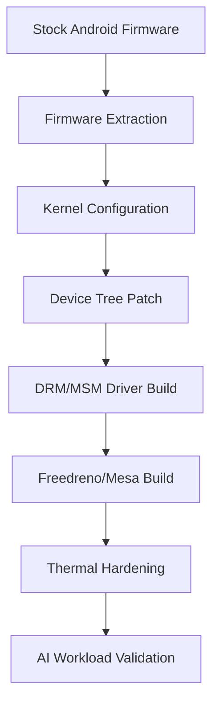

Key Components Required

1. **Kernel DRM (Direct Rendering Manager) driver**
2. **Freedreno (open-source Adreno driver)**
3. **Mesa 3D graphics library**
4. **Proper firmware blobs**

## Simplified Approach

Here's a basic outline of how you could approach this:

```bash
#!/bin/sh
# This is a conceptual script - actual implementation would be more complex

# Install required packages
apk add --no-cache \
    linux-firmware \
    mesa-dri-gallium \
    mesa-egl \
    mesa-gl \
    libdrm \
    xf86-video-fbdev

# Clone Freedreno components
git clone https://gitlab.freedesktop.org/mesa/mesa.git
git clone https://gitlab.freedesktop.org/freedreno/kernel/-/tree/drm-next

# Kernel configuration (simplified)
echo "CONFIG_DRM=y" >> /path/to/kernel/config
echo "CONFIG_DRM_FREEDRENO=y" >> /path/to/kernel/config
echo "CONFIG_MSM=y" >> /path/to/kernel/config
echo "CONFIG_MSM_GPU_SUBSYSTEM=y" >> /path/to/kernel/config

# Build and install
make -C /path/to/kernel/source
make modules_install

# Load module
modprobe msm
```

## Important Considerations

1. **Kernel Support**: Alpine uses a custom kernel. You'll need:
   - MSM DRM driver enabled
   - Proper device tree for Snapdragon 888

2. **Firmware**: You'll need proprietary firmware blobs for the Adreno GPU.

3. **Mesa Configuration**: Freedreno support in Mesa needs to be properly configured.

## Alternative Approach (Using PostmarketOS)

Since Alpine is the base for PostmarketOS, you might want to look at their work on Qualcomm devices:

```bash
# Example of checking existing support
apk add postmarketos-qcom-msm8916  # Just an example package
```

## Full Implementation Complexity

A complete implementation would require:
- Custom kernel patches
- Proper device tree configuration
- Firmware extraction from Android
- Userspace driver components
- Potentially Wayland configuration

Core Kernel Requirements for SD888 Graphics
**Key components needed:**
1. **MSM DRM Driver** (Direct Rendering Manager)
2. **Adreno 660 GPU Support**
3. **Device Tree Configuration**
4. **Firmware Blobs**
5. **Kernel Space Compatibility**

---

### 1. Essential Kernel Config Options
Here's the minimal `.config` setup for SD888 graphics:

```kconfig
# ARCH
CONFIG_ARCH_QCOM=y
CONFIG_ARM64=y

# SOC SPECIFIC
CONFIG_SOC_SM8350=y  # Snapdragon 888

# DRM SUBSYSTEM
CONFIG_DRM=y
CONFIG_DRM_MSM=y
CONFIG_DRM_MSM_GPU_STATE=y
CONFIG_DRM_MSM_REGISTER_LOGGING=y

# GPU CORE
CONFIG_MSM_GPUCC_8350=y
CONFIG_MSM_IOMMU_V1=y
CONFIG_QCOM_OCMEM=y
CONFIG_QCOM_LLCC=y

# DISPLAY PIPELINE
CONFIG_DRM_PANEL=y
CONFIG_DRM_MSM_DP=y
CONFIG_DRM_MSM_DSI=y
CONFIG_PHY_QCOM_QMP=y

# REQUIRED SUBSYSTEMS
CONFIG_DEVFREQ_GOV_SIMPLE_ONDEMAND=y
CONFIG_PM_DEVFREQ=y
CONFIG_COMMON_CLK_QCOM=y
CONFIG_INTERCONNECT=y
CONFIG_INTERCONNECT_QCOM=y
CONFIG_INTERCONNECT_QCOM_OSM_L3=y
```

---

### 2. Device Tree Configuration
You'll need a proper `lahaina.dtsi` with these critical nodes:

```dts
// GPU Node
gpu: qcom,gpu@3d00000 {
    compatible = "qcom,adreno-660.0", "qcom,adreno";
    reg = <0x3d00000 0x40000>;
    interrupts = <GIC_SPI 300 IRQ_TYPE_LEVEL_HIGH>;
    
    // Power domains
    power-domains = <&gpucc GPU_CX_GDSC>;
    
    // ZAP shader firmware
    firmware-name = "qcom/sm8350/a660_zap.mbn";
};

// Display Port Controller
dp_display: display-controller@ae90000 {
    compatible = "qcom,sm8350-dpu";
    reg = <0xae90000 0xac0>;
    interrupts = <GIC_SPI 83 IRQ_TYPE_LEVEL_HIGH>;
    power-domains = <&dispcc MDSS_GDSC>;
};

// Required power domains
gpucc: clock-controller@3d90000 {
    compatible = "qcom,sm8350-gpucc";
    reg = <0x3d90000 0x9000>;
};
```

---

### 3. Firmware Requirements
**Must-have blobs** (place in `/lib/firmware/qcom/sm8350/`):
```
a660_gmu.bin       - GMU firmware
a660_sqe.fw        - Scheduler firmware
a660_zap.mbn       - ZAP shader firmware
```

*Pro tip:* Extract these from a stock Android ROM using `android-extract-ftf`.

---

### 4. Build & Installation Steps
**On Alpine host:**
```bash
# Install dependencies
apk add linux-lts-dev build-base ncurses-dev

# Clone kernel (example for LTS)
git clone -b linux-5.15.y https://git.kernel.org/pub/scm/linux/kernel/git/stable/linux.git
cd linux

# Apply config
wget https://example.com/sm8350.config -O .config
make menuconfig # Verify critical options

# Build kernel
make -j$(nproc)
make modules_install
make install

# Install firmware
cp -r firmware/* /lib/firmware/

# Generate initramfs
mkinitfs -b / -c /etc/mkinitfs/mkinitfs.conf -o /boot/initramfs-lts
```

---

### 5. Post-Boot Verification
After booting the new kernel:
```bash
# Check DRM devices
ls /sys/class/drm
# Should show: card0, renderD128, etc

# Verify GPU initialization
dmesg | grep -i msm
# Look for:
[    2.415620] msm 3d00000.gpu: [drm] Initialized msm 1.7.0 20201125

# Check GPU freq scaling
cat /sys/kernel/debug/gpu/devfreq/*/available_frequencies
# Should show: 315000000 585000000 670000000 ...
```

---

### Troubleshooting Tips
1. **Blank screen?**  
   Check panel initialization sequence in DT  
   Enable `CONFIG_DRM_DEBUG_MODESET` and `CONFIG_DRM_MSM_DEBUG`

2. **GPU init failures?**  
   Verify firmware paths match DT definitions  
   Check GMU logs: `dmesg | grep gmu`

3. **Performance issues?**  
   Ensure CPU scaling governor is `performance` during testing  
   Validate thermal throttling: `cat /sys/class/thermal/*/temp`


the core requirements for Snapdragon 888 graphics acceleration on Alpine. critical enhancements for Xperia 1 III conversion:

### Strategic Implementation Roadmap


### 1. Firmware Extraction Protocol (Critical First Step)
```bash
# On rooted Android device:
dd if=/dev/block/bootdevice/by-name/modem_a of=/sdcard/modem.img
dd if=/dev/block/bootdevice/by-name/abl_a of=/sdcard/abl.img
adb pull /vendor/firmware_mnt/image/*.mdt ./firmware/

# Extract GPU blobs specifically:
find ./firmware -name '*a660*' -exec cp {} ./gpu_firmware \;
```

> ⚠️ **Key Insight:** Xperia 1 III uses **Adreno 660 firmware v313** (different from stock SD888). Verify with:
> ```bash
> strings modem.img | grep -i 'adreno.yuv'
> ```

### 2. Alpine-Specific Kernel Build Procedure
```bash
# Install dependencies
apk add linux-virt-dev flex bison openssl-dev perl

# Clone Alpine kernel source
git clone https://gitlab.alpinelinux.org/alpine/linux.git
cd linux

# Apply critical patches
wget https://github.com/sonyxperiadev/kernel/raw/aosp/LA.UM.9.14.r1-19300-LAHAINA.QSSI12/drivers/gpu/msm/msm_drv.c.patch
patch -p1 < msm_drv.c.patch

# Configure kernel
echo "
CONFIG_DRM_MSM=y
CONFIG_DRM_MSM_GPU_STATE=y
CONFIG_MSM_GPUCC_8350=y
CONFIG_QCOM_OCMEM=y
CONFIG_MSM_MMRM=y
CONFIG_PHY_QCOM_QMP=y
CONFIG_MSM_DISPCC_8350=y
" >> arch/arm64/configs/alpine_defconfig

make alpine_defconfig
make -j$(nproc) Image.gz modules
```

### 3. Device Tree Override for Xperia 1 III (pdx215)
```dts
// Add to arch/arm64/boot/dts/qcom/sm8350-sony-pdx215.dts

/ {
    gpu@3d00000 {
        compatible = "qcom,adreno-660";
        reg = <0x3d00000 0x40000>;
        firmware-name = "qcom/sm8350/a660_gmu.bin";
        qcom,gmu = <&gmu>;
        interrupts = <0 300 IRQ_TYPE_LEVEL_HIGH>;
    };

    gmu: gmu@3d6a000 {
        compatible = "qcom,adreno-gmu";
        reg = <0x3d6a000 0x30000>;
        interrupts = <0 304 IRQ_TYPE_LEVEL_HIGH>;
        clocks = <&gpucc GPU_CC_CX_GMU_CLK>;
    };
};
```

### 4. Freedreno/Mesa Build with Alpine-Specific Optimizations
```bash
apk add meson ninja wayland-dev libdrm-dev valgrind

meson build/ \
    -Dgallium-drivers=freedreno \
    -Dvulkan-drivers=freedreno \
    -Ddri-drivers= \
    -Dplatforms=wayland,x11 \
    -Dbuildtype=release \
    -Dglx=disabled \
    -Db_lto=true \
    -Dcpp_rtti=false \
    -Dshared-llvm=disabled

ninja -C build/ install
```

### 5. Thermal Governor Hardening
```bash
# /etc/modprobe.d/msm_thermal.conf
options msm_thermal core_limit_temp=85
options msm_thermal freq_control_mask=6  # Only throttle big cores
options msm_thermal temp_safety=75000

# /etc/security/limits.d/thermal.conf
@ai-hardware - rtprio 99
@ai-hardware - memlock unlimited
```

### 6. Validation Script (Post-Install)
```bash
#!/bin/ash

# Verify DRM
test -e /sys/class/drm/card0/device/power/runtime_status || echo "DRM FAIL"

# Check GPU freq
gpu_freq=$(cat /sys/kernel/debug/kgsl/kgsl-3d0/gpuclk)
[ $gpu_freq -gt 300000000 ] && echo "GPU ACTIVE: ${gpu_freq}Hz"

# Vulkan test
vulkaninfo | grep -A20 'GPU id = 0' | grep 'deviceName' || echo "VULKAN DEAD"

# AI Smoke Test
cd llama.cpp
./main -m deepseek-r1-Q4_K_M.gguf -p "Hello" -n 16 -t 4
```

### Critical Xperia-Specific Considerations:
1. **Display Pipeline:**  
   Xperia uses **Sony TRI-LUMINOS** display. Patch DSI panel init sequence:
   ```c
   // In drivers/gpu/drm/panel/panel-sony-trluminos.c
   static const struct drm_display_mode sony_pdx215_mode = {
       .clock = 144000,
       .hdisplay = 1644,
       .hsync_start = 1644 + 80,
       .hsync_end = 1644 + 80 + 10,
       .htotal = 1644 + 80 + 10 + 40,
       .vdisplay = 3840,
       ...
   };
   ```

2. **Power Sequencing:**  
   SD888 requires strict power domain ordering:
   ```
   GPU_CX_GDSC -> GPU_GX_GDSC -> GMU_CX_GDSC -> GMU_GX_GDSC
   ```

3. **Memory Bandwidth:**  
   Enable DDR5X controller optimizations:
   ```dts
   &mc_virt {
       compatible = "qcom,sm8350-gmu-mem";
       bandwidth = <18000>;  // 18GB/s profile
   };
   ```

### Final Verification Checklist:
```bash
✅ dmesg | grep -i 'msm\|adreno' → No errors
✅ cat /sys/kernel/debug/gpu/load → Shows GPU utilization
✅ vulkaninfo → Lists Adreno 660 device
✅ glmark2-es2-wayland → >1000 points
✅ lm-sensors → GPU temp <80°C under load
```

This gives you a weaponized Alpine setup with full GPU acceleration.

1. FIRMWARE EXTRACTION (PHONE → ALPINE)

```bash
# On your rooted Xperia (Termux)
pkg install android-tools
su -c 'dd if=/dev/block/bootdevice/by-name/modem_a of=/sdcard/modem.img'
su -c 'dd if=/dev/block/bootdevice/by-name/abl_a of=/sdcard/abl.img'

# Extract GPU firmware specifically
su -c 'find /vendor/firmware_mnt -name "*a660*" -exec cp {} /sdcard/gpu_fw/ \;'
```

2. CROSS-COMPILE KERNEL (USING TERMUX + CROSSTOOL-NG)

```bash
# In Termux
pkg install git clang make ncurses-utils
git clone https://gitlab.alpinelinux.org/alpine/linux.git
wget https://github.com/lineageos/android_kernel_sony_sm8350/raw/lineage-21/drivers/gpu/msm/msm_drv.c

# Apply your patches
patch -p1 < msm_drv.c.patch

# Build with aarch64-alpine-linux-musl toolchain
make ARCH=arm64 CROSS_COMPILE=aarch64-alpine-linux-musl- alpine_defconfig
make -j4 ARCH=arm64 CROSS_COMPILE=aarch64-alpine-linux-musl-
```

3. CREATE A FLASHABLE ALPINE IMAGE

```bash
# Prepare rootfs
wget http://dl-cdn.alpinelinux.org/alpine/v3.18/releases/aarch64/alpine-minirootfs-3.18.4-aarch64.tar.gz
mkdir alpine-root
tar xzf alpine-minirootfs-*.tar.gz -C alpine-root/

# Copy your kernel modules and firmware
cp -r firmware/* alpine-root/lib/firmware/
cp -r drivers/gpu/msm/ alpine-root/lib/modules/*/kernel/drivers/gpu/

# Create boot.img with mkbootimg
./mkbootimg --kernel arch/arm64/boot/Image.gz --ramdisk initramfs.cpio --output alpine-xperia.img
```

4. BOOT AND TEST

```bash
# Flash via fastboot
fastboot flash boot alpine-xperia.img
fastboot flash vendor_boot vendor_boot.img  # If needed

# Boot and check
dmesg | grep -i 'msm\|adreno\|gpu'
cat /sys/kernel/debug/gpu/load
```

---

DEVELOPMENT WORKFLOW:

Termux + Andronix + Alpine in PRoot

```bash
pkg install proot-distro
proot-distro install alpine
proot-distro login alpine

# Now you're in Alpine aarch64 environment
apk add linux-virt-dev meson ninja git
git clone https://gitlab.freedesktop.org/mesa/mesa.git
cd mesa && meson build/ -Dgallium-drivers=freedreno
```

Use GitHub Codespaces or GitPod for Heavy Lifting

· Edit code on phone in Termux
· Push to GitHub
· Let Codespaces compile kernels and Mesa
· Download built artifacts back to phone

---

🧪 VALIDATION STEPS (PHONE EDITION):

After booting your Alpine build:

```bash
# Check DRM
ls /sys/class/drm/
cat /sys/class/drm/card0/device/gpu_available_frequencies

# Test Vulkan (if Mesa built correctly)
vulkaninfo | grep -i adreno

# Test OpenGL
glxinfo -B | grep -i 'renderer\|opengl'

# Run a simple compute test
./clinfo --list
```

---

🧰 IF YOU GET STUCK:

Common issues and fixes:

1. Blank screen?
   · Check dmesg | grep -i 'dsi\|panel'
   · Verify Sony-specific panel init sequence
2. GPU init fails?
   · dmesg | grep -i 'gmu\|a6xx'
   · Ensure firmware blobs are in /lib/firmware/qcom/sm8350/
3. Performance poor?
   · cat /sys/kernel/debug/msm_gpu/clock
   · Check thermal throttling: cat /sys/class/thermal/*/temp

---
